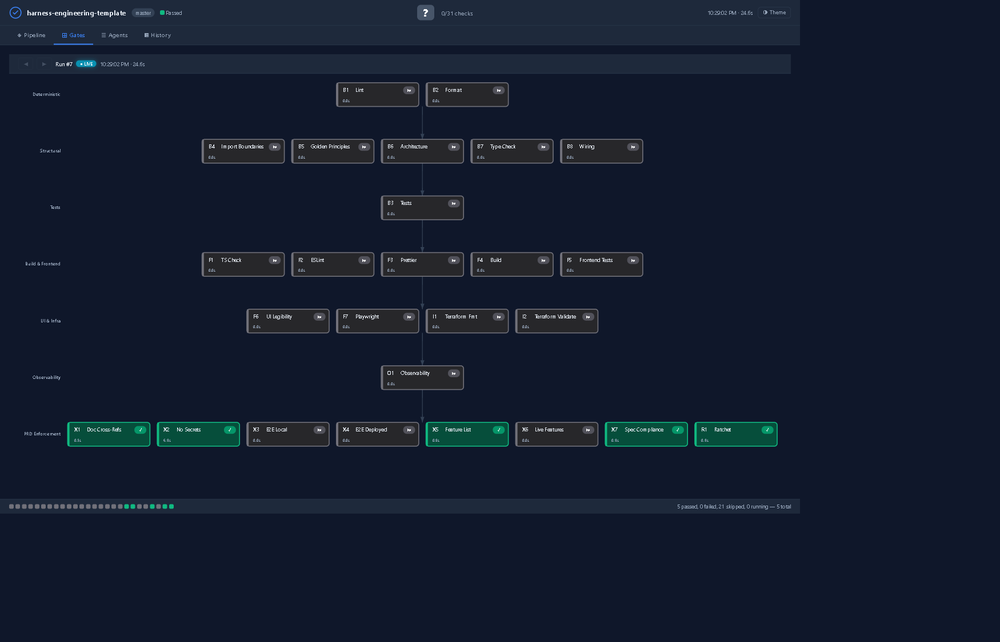
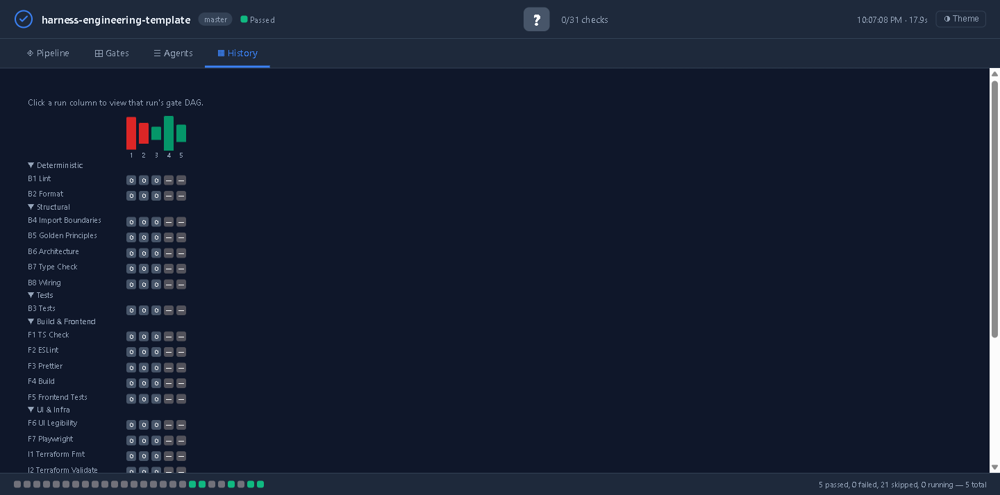

# Harness Engineering Template

> 22 validation gates. 7 layers of testing. Zero human review bottleneck. Deploy the full harness into any repo with one command.


## What Is Harness Engineering?

Harness engineering is the discipline of designing environments, constraints, and feedback loops that enable AI coding agents to write reliable software at scale. Instead of writing code directly, engineers design the system that makes agents write *good* code.

AI agents replicate patterns already present in a repository — including bad ones. The harness prevents architectural drift by encoding invariants into AST-based scripts, enforcing them in CI, and making the running application visible to agents for self-validation. The investment is in the harness, not the code. The code is the dividend.

## Quick Start — Bootstrap Any Repo

### With Claude Code (fully automatic)

**Step 1** — Install the bootstrap command globally (one time per machine):
```bash
mkdir -p ~/.claude/commands
curl -o ~/.claude/commands/bootstrap.md \
  https://raw.githubusercontent.com/ryanhaqueIT/harness-engineering-template/master/.claude/commands/bootstrap.md
```

**Step 2** — Open your target repo in Claude Code:
```bash
cd /path/to/your-project
claude
```

**Step 3** — Run the bootstrap inside Claude Code:
```
/bootstrap
```

That's it. Claude scans your repo, detects the stack, copies and configures all 22 scripts, writes AGENTS.md, seeds the feature list, runs validate.sh, initializes the ratchet, and reports a scorecard grade. Zero manual steps.

### With Any AI Agent (Codex, Cursor, Copilot, Windsurf)

```bash
curl -sL https://raw.githubusercontent.com/ryanhaqueIT/harness-engineering-template/master/bootstrap.sh | bash
```

This handles the mechanical parts (copying scripts, creating directories). Then tell your agent:

> "Read ~/.harness/playbooks/01-analyze.md and complete the harness setup for this project."

The agent configures the import rules, writes AGENTS.md, and finishes the intelligent parts.

### Manual (clone and setup)

```bash
git clone https://github.com/ryanhaqueIT/harness-engineering-template.git my-project
cd my-project
bash setup.sh
```

The interactive setup asks for project name, language, framework, and infrastructure tool, then configures everything.

## Live DAG Dashboard

Watch all 25 validation gates execute in real-time with an Airflow-inspired DAG visualization. Zero dependencies — one command opens it in your browser.

| Gates (DAG View) | History (Airflow Grid View) |
|---|---|
|  |  |

```bash
bash scripts/dashboard.sh          # Opens the dashboard in your browser
bash scripts/validate.sh           # Run in another terminal — watch gates light up
```

**4 views** — Pipeline (development flow), Gates (25 gates in 7 layers), Agents (8 specialized agents), History (Airflow Grid View with run-over-run comparison). Navigate between runs with arrow keys. Click any gate for details. Dark/light theme.

## The 23-Gate Validation Suite

Every line of code passes through `validate.sh`. Nothing gets committed until it exits 0.

| Layer | Gates | What They Verify |
|-------|-------|-----------------|
| **1. Deterministic** | B1 (lint), B2 (format), B7 (types), F1-F3 | Code is syntactically correct |
| **2. Structural** | B4 (imports), B5 (golden principles), B6 (architecture), X1-X2 | Architecture rules followed, no secrets |
| **3. Unit/Integration** | B3 (pytest), F4-F5 (frontend tests) | Behavior is correct |
| **4. Functional** | F6-F7 (HTTP smoke, API contract) | Endpoints respond correctly |
| **5. App Legibility** | F8 (Playwright + `playwright_gate.py`) | UI works — navigate, click, fill, assert via accessibility tree |
| **6. Observability** | O1 (`check_observability.sh`) | LogsQL: no ERRORs/PANICs. PromQL: p95 < 2s |
| **7. PRD Enforcement** | X5 (feature checklist), X6 (live feature tests) | Features mechanically verified against running app |
| **Ratchet** | R1 | Quality can never regress |

## End-to-End Flow: PRD to Verified Code

This is how harness engineering replaces human review with mechanical verification.

```
┌─────────────────────────────────────────────────────────┐
│  1. PROVIDE PRD                                         │
│     Drop your PRD into docs/product-specs/              │
│     Or just describe what you want to the agent         │
└──────────────────────┬──────────────────────────────────┘
                       ▼
┌─────────────────────────────────────────────────────────┐
│  2. GENERATE PLAN                                       │
│     Run /plan — agent reads PLANS.md template           │
│     Outputs: docs/exec-plans/active/feature-name.md     │
│     Contains: milestones, concrete steps, acceptance    │
│     criteria as observable outcomes                      │
└──────────────────────┬──────────────────────────────────┘
                       ▼
┌─────────────────────────────────────────────────────────┐
│  3. SEED FEATURE LIST                                   │
│     Agent writes .harness/feature_list.json              │
│     Each PRD requirement becomes a feature with:        │
│     - Executable steps (Send POST, Verify 201, etc.)    │
│     - Expected values (response.total equals 60.50)     │
│     - passes: false (not yet verified)                  │
│     THE AGENT CANNOT CHANGE THESE STEPS LATER           │
└──────────────────────┬──────────────────────────────────┘
                       ▼
┌─────────────────────────────────────────────────────────┐
│  4. IMPLEMENT                                           │
│     Agent reads ExecPlan, writes code milestone by      │
│     milestone. After each change, runs validate.sh.     │
│     22 structural gates block bad code mechanically.    │
│     The Ralph Wiggum Loop: implement → validate →       │
│     fix → re-validate → until exit 0                    │
└──────────────────────┬──────────────────────────────────┘
                       ▼
┌─────────────────────────────────────────────────────────┐
│  5. VERIFY FEATURES (the key step)                      │
│     Agent boots the app: ./scripts/boot_worktree.sh     │
│                                                         │
│     Gate X6 (check_features_live.py) executes:          │
│     ┌───────────────────────────────────────────┐       │
│     │ API features:                             │       │
│     │   Sends real HTTP requests to running app │       │
│     │   Checks status codes, response bodies    │       │
│     │   Verifies exact field values             │       │
│     │   Verifies data persisted correctly       │       │
│     ├───────────────────────────────────────────┤       │
│     │ UI features:                              │       │
│     │   Opens headless browser (Playwright)     │       │
│     │   Navigates pages, fills forms, clicks    │       │
│     │   Asserts text and elements exist         │       │
│     │   Saves accessibility tree snapshots      │       │
│     └───────────────────────────────────────────┘       │
│     Only features that PASS get flipped to true.        │
│     The runner does the flipping, not the agent.        │
└──────────────────────┬──────────────────────────────────┘
                       ▼
┌─────────────────────────────────────────────────────────┐
│  6. COMMIT (only if ALL gates pass)                     │
│     validate.sh runs all 23 gates:                      │
│     ✓ Code lints and formats (Layers 1-2)              │
│     ✓ Architecture rules followed (Layers 3-5)         │
│     ✓ Unit tests pass (Layer 3)                        │
│     ✓ UI works in browser (Layer 5)                    │
│     ✓ No ERROR logs, p95 < 2s (Layer 6)               │
│     ✓ ALL features verified against running app (L7)   │
│     ✓ Quality ratchet: can't regress                   │
│     If any gate fails → COMMIT BLOCKED                  │
└──────────────────────┬──────────────────────────────────┘
                       ▼
┌─────────────────────────────────────────────────────────┐
│  7. SHIP                                                │
│     Code is mechanically verified to:                   │
│     - Follow architecture rules (AST-enforced)          │
│     - Pass all unit tests                               │
│     - Have all PRD features working (live-tested)       │
│     - Render correctly in a browser                     │
│     - Produce clean logs and fast responses             │
│     - Never regress from current quality baseline       │
│     No human review needed.                             │
└─────────────────────────────────────────────────────────┘
```

## Key Capabilities

### Feature List Gate (PRD Enforcement)
Based on [Anthropic's harness pattern](https://www.anthropic.com/engineering/effective-harnesses-for-long-running-agents). Features are tracked in `.harness/feature_list.json`. Each has `passes: true/false`. The agent can only flip `passes` to `true` after verification — it cannot remove features, edit descriptions, or skip steps.

### Browser Automation (Playwright)
`playwright_gate.py` drives the UI like a QA engineer using accessibility tree snapshots (not screenshots). Supports: navigate, click, fill forms, assert text/elements. Saves a11y snapshots for debugging.

### Runtime Observability
Queries VictoriaLogs (LogsQL) and VictoriaMetrics (PromQL) for real signals: ERROR/PANIC log counts, p95 latency, feature-specific log assertions. Based on [OpenAI's per-worktree observability](https://openai.com/index/harness-engineering/).

### Quality Ratchet
`ratchet.py` counts violations across 8 categories and saves a baseline. Violations can only go down, never up. If you make the codebase worse, the commit is blocked.

### AST-Based Enforcement
Three Python scripts use Abstract Syntax Tree parsing for unfakeable enforcement:
- `check_imports.py` — Module dependency boundaries (routers can't import db)
- `check_golden_principles.py` — No print(), no secrets, type hints, no bare except
- `check_architecture.py` — No God files, DB containment, config containment, naming

### AI-Powered PR Review
`claude-review.yml` runs on every PR. Claude reviews the diff against `QUALITY_SCORE.md` rubric: Code Quality (1-5), Test Quality (1-5), Architecture (1-5), Security (pass/fail), Reliability (pass/fail).

### Entropy Management
- Weekly doc-gardening finds orphan docs and broken references
- Daily quality scans track metrics and detect drift
- Entropy cleaner agent hunts stale TODOs, dead code, and dependency drift
- Harness scorecard grades maturity across 31 checks (A+ through F)

## Bootstrap Workflow

When you run `/bootstrap`, the agent executes four phases:

| Phase | What Happens |
|-------|-------------|
| **0. Discover** | Scans the repo: language, framework, modules, DB library, AI libraries, API endpoints, frontend pages, existing harness |
| **1. Analyze** | Derives import rules, architecture constants, feature list seed, three-tier boundaries. Traces actual imports to build the dependency DAG |
| **2. Generate** | Copies 22 scripts, configures them, writes AGENTS.md/CLAUDE.md/copilot-instructions.md, seeds feature list, installs CI workflows and Claude Code integration |
| **3. Verify** | Runs validate.sh, initializes ratchet baseline, runs scorecard, verifies script syntax and agent file consistency |

Playbooks: `playbooks/00-discover.md` through `playbooks/03-verify.md`

## Repository Structure

```
harness-engineering-template/
  bootstrap.sh              # Agent-agnostic bootstrap script
  setup.sh                  # Interactive setup (clone-and-use)
  AGENTS.md                 # Entry point for AI agents
  PLANS.md                  # ExecPlan template and rules
  playbooks/
    00-discover.md          # Phase 0: repo scanning
    01-analyze.md           # Phase 1: architecture analysis
    02-generate.md          # Phase 2: harness generation
    03-verify.md            # Phase 3: verification
  scripts/
    validate.sh             # THE UNIVERSAL GATE (22 gates)
    check_imports.py        # AST-based import boundary enforcement
    check_golden_principles.py  # AST-based golden principles
    check_architecture.py   # AST-based architecture invariants
    check_features.py       # Feature list PRD gate
    playwright_gate.py      # Browser automation via a11y tree
    check_observability.sh  # LogsQL + PromQL verification
    check_ui_legibility.sh  # HTTP-based UI smoke tests
    check_e2e_deployed.sh   # E2E against deployed instance
    ratchet.py              # Forward-only quality ratchet
    harness_scorecard.py    # 31-check maturity scorecard
    boot_worktree.sh        # Per-worktree app booting
    query_logs.sh           # LogsQL query helper
    query_metrics.sh        # PromQL query helper
  agents/
    bootstrapper.md         # Bootstrap agent definition
    planner.md              # ExecPlan generation agent
    reviewer.md             # Code review agent
    entropy-cleaner.md      # Entropy detection agent
  .claude/
    commands/               # Slash commands (/validate, /bootstrap, /scorecard, etc.)
    hooks/                  # Pre-commit and post-edit hooks
    settings.json           # Permissions and hook configuration
  .github/workflows/
    ci.yml                  # CI pipeline (all gates)
    claude-review.yml       # AI-powered PR review
    quality-scan.yml        # Daily quality dashboard
    doc-gardening.yml       # Weekly documentation entropy scan
  docs/
    QUALITY_SCORE.md        # Grading rubric
    SECURITY.md             # Security standards
    RELIABILITY.md          # Reliability standards
    design-docs/            # Locked architectural decisions
    exec-plans/             # Active and completed execution plans
    product-specs/          # Feature specifications
  .harness/
    feature_list.json       # PRD feature tracking
    baseline.json           # Ratchet quality baseline
  docker-compose.observability.yml  # VictoriaLogs + VictoriaMetrics + Vector
```

## Credits

This methodology synthesizes:
- [OpenAI's "Harness engineering: leveraging Codex in an agent-first world"](https://openai.com/index/harness-engineering/) (February 2026) — 7-layer pyramid, application legibility, per-worktree observability
- [Anthropic's "Effective harnesses for long-running agents"](https://www.anthropic.com/engineering/effective-harnesses-for-long-running-agents) (November 2025) — Feature list gate, browser automation, session verification protocol
- [Stripe's "Minions: one-shot end-to-end coding agents"](https://stripe.dev/blog/minions-stripes-one-shot-end-to-end-coding-agents) — CI-as-feedback-loop, two-attempt maximum, context-over-iteration
- [agentic-harness-bootstrap](https://github.com/) — 4-phase playbook workflow, three-tier boundaries, standing maintenance orders

## License

MIT
