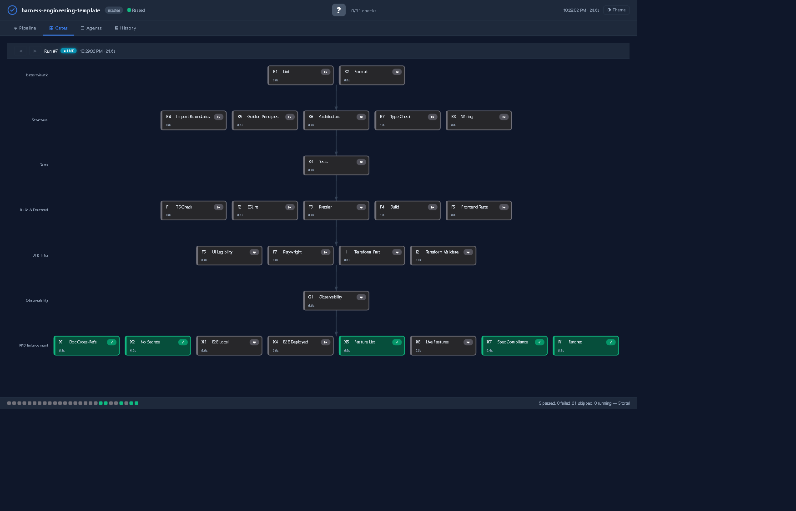
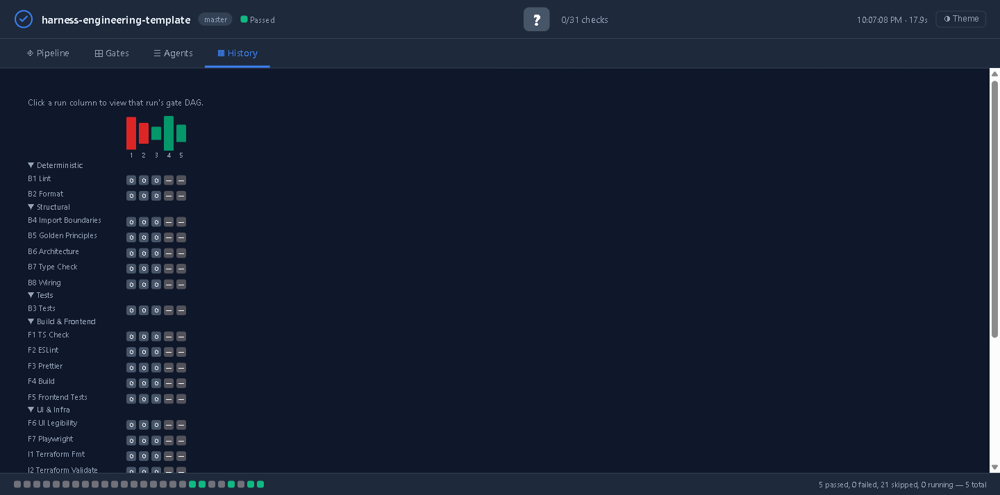

# Harness Engineering Template

> 28 validation gates. 7 layers of testing. End-to-end autonomous build via `/ship`. Adversarial TDD enforced mechanically. Independent codex review on every commit. Zero human review bottleneck. Deploy the full harness into any repo with one command.


## What Is Harness Engineering?

Harness engineering is the discipline of designing environments, constraints, and feedback loops that enable AI coding agents to write reliable software at scale. Instead of writing code directly, engineers design the system that makes agents write *good* code.

AI agents replicate patterns already present in a repository — including bad ones. The harness prevents architectural drift by encoding invariants into AST-based scripts, enforcing them in CI, and making the running application visible to agents for self-validation. The investment is in the harness, not the code. The code is the dividend.

## Quick Start — Bootstrap Any Repo

### With Claude Code (fully automatic)

**Step 1** — Install the bootstrap command globally (one time per machine):
```bash
mkdir -p ~/.claude/commands
curl -o ~/.claude/commands/bootstrap.md \
  https://raw.githubusercontent.com/ryanhaqueIT/harness-engineering-template/master/.claude/commands/bootstrap.md
```

**Step 2** — Open your target repo in Claude Code:
```bash
cd /path/to/your-project
claude
```

**Step 3** — Run the bootstrap inside Claude Code:
```
/bootstrap
```

That's it. Claude scans your repo, detects the stack, copies and configures all 22 scripts, writes AGENTS.md, seeds the feature list, runs validate.sh, initializes the ratchet, and reports a scorecard grade. Zero manual steps.

### With Any AI Agent (Codex, Cursor, Copilot, Windsurf)

```bash
curl -sL https://raw.githubusercontent.com/ryanhaqueIT/harness-engineering-template/master/bootstrap.sh | bash
```

This handles the mechanical parts (copying scripts, creating directories). Then tell your agent:

> "Read ~/.harness/playbooks/01-analyze.md and complete the harness setup for this project."

The agent configures the import rules, writes AGENTS.md, and finishes the intelligent parts.

### Manual (clone and setup)

```bash
git clone https://github.com/ryanhaqueIT/harness-engineering-template.git my-project
cd my-project
bash setup.sh
```

The interactive setup asks for project name, language, framework, and infrastructure tool, then configures everything.

## Live DAG Dashboard

Watch all 25 validation gates execute in real-time with an Airflow-inspired DAG visualization. Zero dependencies — one command opens it in your browser.

| Gates (DAG View) | History (Airflow Grid View) |
|---|---|
|  |  |

```bash
bash scripts/dashboard.sh          # Opens the dashboard in your browser
bash scripts/validate.sh           # Run in another terminal — watch gates light up
```

**4 views** — Pipeline (development flow), Gates (25 gates in 7 layers), Agents (8 specialized agents), History (Airflow Grid View with run-over-run comparison). Navigate between runs with arrow keys. Click any gate for details. Dark/light theme.

## The 27-Gate Validation Suite

Every line of code passes through `validate.sh`. Nothing gets committed until it exits 0. Backend stack auto-detected from `requirements.txt`, `pyproject.toml`, `package.json`, `go.mod`, `Cargo.toml`, `pom.xml`, or `build.gradle` — same gate IDs across languages.

| Layer | Gates | What They Verify |
|-------|-------|-----------------|
| **1. Deterministic** | B1 (lint), B2 (format), B7 (types), F1-F3 | Code is syntactically correct |
| **2. Structural** | B4 (imports), B5 (golden principles), B6 (architecture), B8 (wiring), X1-X2 | Architecture rules followed, no orphans, no secrets |
| **3. Unit/Integration** | B3 (tests), F4-F5 (frontend tests) | Behavior is correct |
| **4. Functional** | F6-F7 (HTTP smoke, API contract) | Endpoints respond correctly |
| **5. App Legibility** | F8 (Playwright + `playwright_gate.py`) | UI works — navigate, click, fill, assert via accessibility tree |
| **6. Observability** | O1 (`check_observability.sh`) | LogsQL: no ERRORs/PANICs. PromQL: p95 < 2s |
| **7. PRD Enforcement** | X5 (feature checklist), X6 (live feature tests), X7 (spec compliance) | Features mechanically verified against running app |
| **7. Autonomy** | X8 (spec quality), X9 (loop guard, soft), X10 (TDD compliance) | Catches vague specs; detects stuck loops; enforces test-first |
| **Ratchet** | R1 | Quality can never regress |

## End-to-End Flow: PRD to Verified Code

This is how harness engineering replaces human review with mechanical verification.

```
┌─────────────────────────────────────────────────────────┐
│  1. PROVIDE PRD                                         │
│     Drop your PRD into docs/product-specs/              │
│     Or just describe what you want to the agent         │
└──────────────────────┬──────────────────────────────────┘
                       ▼
┌─────────────────────────────────────────────────────────┐
│  2. GENERATE PLAN                                       │
│     Run /plan — agent reads PLANS.md template           │
│     Outputs: docs/exec-plans/active/feature-name.md     │
│     Contains: milestones, concrete steps, acceptance    │
│     criteria as observable outcomes                      │
└──────────────────────┬──────────────────────────────────┘
                       ▼
┌─────────────────────────────────────────────────────────┐
│  3. SEED FEATURE LIST                                   │
│     Agent writes .harness/feature_list.json              │
│     Each PRD requirement becomes a feature with:        │
│     - Executable steps (Send POST, Verify 201, etc.)    │
│     - Expected values (response.total equals 60.50)     │
│     - passes: false (not yet verified)                  │
│     THE AGENT CANNOT CHANGE THESE STEPS LATER           │
└──────────────────────┬──────────────────────────────────┘
                       ▼
┌─────────────────────────────────────────────────────────┐
│  4. IMPLEMENT                                           │
│     Agent reads ExecPlan, writes code milestone by      │
│     milestone. After each change, runs validate.sh.     │
│     22 structural gates block bad code mechanically.    │
│     The Ralph Wiggum Loop: implement → validate →       │
│     fix → re-validate → until exit 0                    │
└──────────────────────┬──────────────────────────────────┘
                       ▼
┌─────────────────────────────────────────────────────────┐
│  5. VERIFY FEATURES (the key step)                      │
│     Agent boots the app: ./scripts/boot_worktree.sh     │
│                                                         │
│     Gate X6 (check_features_live.py) executes:          │
│     ┌───────────────────────────────────────────┐       │
│     │ API features:                             │       │
│     │   Sends real HTTP requests to running app │       │
│     │   Checks status codes, response bodies    │       │
│     │   Verifies exact field values             │       │
│     │   Verifies data persisted correctly       │       │
│     ├───────────────────────────────────────────┤       │
│     │ UI features:                              │       │
│     │   Opens headless browser (Playwright)     │       │
│     │   Navigates pages, fills forms, clicks    │       │
│     │   Asserts text and elements exist         │       │
│     │   Saves accessibility tree snapshots      │       │
│     └───────────────────────────────────────────┘       │
│     Only features that PASS get flipped to true.        │
│     The runner does the flipping, not the agent.        │
└──────────────────────┬──────────────────────────────────┘
                       ▼
┌─────────────────────────────────────────────────────────┐
│  6. COMMIT (only if ALL gates pass)                     │
│     validate.sh runs all 23 gates:                      │
│     ✓ Code lints and formats (Layers 1-2)              │
│     ✓ Architecture rules followed (Layers 3-5)         │
│     ✓ Unit tests pass (Layer 3)                        │
│     ✓ UI works in browser (Layer 5)                    │
│     ✓ No ERROR logs, p95 < 2s (Layer 6)               │
│     ✓ ALL features verified against running app (L7)   │
│     ✓ Quality ratchet: can't regress                   │
│     If any gate fails → COMMIT BLOCKED                  │
└──────────────────────┬──────────────────────────────────┘
                       ▼
┌─────────────────────────────────────────────────────────┐
│  7. SHIP                                                │
│     Code is mechanically verified to:                   │
│     - Follow architecture rules (AST-enforced)          │
│     - Pass all unit tests                               │
│     - Have all PRD features working (live-tested)       │
│     - Render correctly in a browser                     │
│     - Produce clean logs and fast responses             │
│     - Never regress from current quality baseline       │
│     No human review needed.                             │
└─────────────────────────────────────────────────────────┘
```

## Full Autonomy: The `/ship` Command

The 7 steps above are individually invokable (`/plan`, `/build`, `/validate`, …) but `/ship` chains them into a single autonomous pipeline. Given a PRD or a one-line prompt, it walks the entire flow without human intervention:

```
/ship docs/product-specs/oauth-login.md
/ship "Add a JSON export endpoint for the invoices service"
/ship                              # resume an in-flight build
```

The orchestrator is a state machine (`scripts/ship.py`) persisted to `.harness/ship_state.json`. State survives context compaction — restarting `/ship` resumes from the last completed transition. States:

```
init → intake → spec_qa → planning → seeding → building
     ↻ validating ↔ fixing ↔ rescuing
     → post_review → committing → done
                                ↘ escalated (human needed)
```

Three new pieces back this flow:

| Piece | What it does |
|-------|-------------|
| **`scripts/check_spec_quality.py`** (gate X8) | Mechanical pre-build review of the active ExecPlan. Blocks vague language, demands Demo statements per milestone, requires assertion-style acceptance criteria. Cheaper to fail here than after a wasted build. |
| **`scripts/loop_guard.py`** (gate X9) | Fingerprints each failing validate.sh run by (sorted failing gates × normalized error signature). If the last N runs share a fingerprint, raises a rescue signal — `ship.py` then branches from `fixing` to `rescuing`. |
| **`agents/researcher.md`** | Rescue-path agent. Web-searches the exact failing fingerprint, cross-verifies against official docs and GitHub issues, produces a 3-bullet root-cause analysis with sources. Hands back to `build-fixer` for execution. |

The pipeline tries up to 12 fix+rescue cycles per feature before escalating. Loop fingerprints are stored to `.harness/loop_guard_state.json`; rescue requests go to `.harness/rescue_request.md`; the full transition history is logged to `.harness/ship_log.md`.

### Adversarial TDD — Cross-Model, Enforced Mechanically

The harness mandates the Iron Law of TDD: **no production code without a failing test first**. The adversarial pair runs on **two different models** to maximise the gap between what the tests cover and what the implementation produces:

| Role | Model | Why |
|------|-------|-----|
| **Tester** (RED) | **Codex** (via `Skill("codex:rescue")`) | Different training distribution = different blind spots. Catches the cases the impl model would forget. |
| **Executor** (GREEN) | **Claude** | Implements minimum code against the tests. Never sees the spec — only the tests are the contract. |

If codex is unavailable, the tester falls back to Claude and the build is tagged `tester=claude-fallback`; downstream `adversarial_review` codex findings then get extra weight in the verdict.

Enforcement at four points:

| Layer | Enforcement |
|-------|-------------|
| **Skill invocation** | `agents/tester.md` mandates `Skill("superpowers:test-driven-development")` then `Skill("codex:rescue")`. `agents/executor.md` mandates the TDD skill and acknowledges the cross-model split. |
| **Model separation** | The tester runs on codex, the executor on Claude. Verified by ship.py spawning sequence in the `building` state — same-model fallback is recorded. |
| **Adversarial information split** | The tester never sees the implementation. The executor never sees the feature spec — only the tests. |
| **Mechanical gate X10** | `scripts/check_tdd.py` scans the git diff and verifies every changed implementation file has a corresponding test file. Convention-aware: pytest's `test_*.py`, Jest's `*.test.tsx`, Go's `*_test.go`, Java's `*Test.java`. Excludes entry points, config, migrations. |

The gate is convention-based and unfoolable: an agent can't satisfy X10 by writing a test that imports the implementation, because the gate doesn't look inside files — it just verifies the test artefact exists where it should. And the cross-model split means the *content* of those tests is unlikely to share blind spots with the impl.

### Independent Codex Review

Single-model review has a known blind spot: the same model that wrote the code is the model least likely to spot its bugs (same training distribution = same misses). The harness uses the **codex plugin** as a second-opinion model on every build:

| Checkpoint | What codex does |
|------------|-----------------|
| **`rescuing` state** | When `loop_guard` fires, codex provides an independent diagnosis *in parallel with* the `researcher` agent's web-sourced analysis. Two diagnoses are compared; the harness routes the higher-confidence one (or merges them if they agree). |
| **`adversarial_review` state** | After `post_review` passes, codex gets the diff and is prompted to find a defect the tests would miss. `NO DEFECT FOUND` → commit. `DEFECT: SEVERITY: blocker` → back to fixing. `SEVERITY: warning` → commit with the warning logged. |

The codex integration is gated by `Skill("codex:rescue")` — if codex isn't installed, the skill offers to install it; if codex can't be reached, the agent falls back with `CONFIDENCE: low` so the orchestrator knows to weigh it lightly.

## Dynamic Workflow: Deterministic Feature Delivery

`/ship` is powerful, but its orchestration logic lives in Claude's context window — the model reads `ship.md` and decides each step, which can vary across runs. The **`harness-feature-delivery` dynamic workflow** solves this by moving the orchestration into code: a JavaScript script the runtime executes deterministically, the same way every time, regardless of context length or model state.

The distinction matters in practice. `/ship` is model-as-orchestrator. The dynamic workflow is code-as-orchestrator — `pipeline(milestones)` fans out automatically, milestones overlap (M2 starts while M1 validates), and no step can be skipped because the runtime enforces the sequence, not the model's memory of what it was supposed to do.

### How to run it

After `/bootstrap`, the workflow is ready in `.claude/workflows/`. Trigger it two ways:

**Natural language:**
```
use the harness-feature-delivery workflow to add OAuth login with Google
```

**Via the `/workflows` UI:**
```
/workflows
```
Select `harness-feature-delivery`, enter the feature description, approve the phases, and it runs in the background while your session stays responsive.

### What it does

The workflow drives four phases with the harness gates enforcing at every boundary:

```
DESIGN  → PRD + ERD written in parallel
        → Codex adversarial spec review (different model critiques the spec)
        → check_spec_quality.py gate — blocks vague or incomplete specs
        → feature_list.json seeded and hash-locked (X11 detects step edits)
        → ExecPlan written with milestones
        → E2E test skill generated for this feature (Playwright MCP + real APIs)

BUILD   → pipeline(milestones) — no barrier, milestones overlap
          Per milestone:
            [Codex] writes failing tests  ← cross-model TDD
            [Claude] implements against them
            validate.sh static gates loop until exit 0
            fix agent (max 3 attempts) → rescue (parallel researcher + codex-reviewer) → escalate

VERIFY  → Boot app
        → Three testing layers in sequence:
            Layer 1: validate.sh full suite with RUN_LIVE=true (29 gates)
            Layer 2: X6 live feature check (real HTTP + Playwright)
            Layer 3: Generated E2E skill (non-deterministic — real external systems,
                     timing, Playwright MCP — distinguishes code bugs from env noise)
        → X11 mutation gate (tests must fail on mutated code)
        → stop_verification re-derives every passes:true claim independently
        → X12 tier audit (no guaranteed gate has silently become unwired)

SHIP    → R1 ratchet check
        → Conventional commit with full provenance
```

### Three testing layers

The workflow separates testing into three layers with different failure semantics:

| Layer | What runs | Failure means |
|---|---|---|
| **1 — Deterministic** | `validate.sh` static gates (B1–B8, F1–F7, X1–X10, R1) | Code is wrong — fix it |
| **2 — Semi-deterministic** | X6 live feature check (real HTTP, requires booted app) | Usually code is wrong |
| **3 — Non-deterministic** | Generated E2E skill (Playwright MCP, real external APIs) | May be code bug OR environment noise (e.g. test API throttling) — must distinguish |

Layer 3 is generated during the Design phase from the PRD acceptance criteria — a feature-specific `.claude/commands/test-<feature>.md` that knows exactly what to call, assert, and how to interpret environmental limitations.

### Getting the workflow in a new repo

The workflow ships with bootstrap. Re-running `/bootstrap` on an existing repo updates it automatically — bootstrap hard-resets `~/.harness` to latest master and copies `.claude/workflows/*.js` into the target repo. No extra steps needed.

---

## Key Capabilities

### Feature List Gate (PRD Enforcement)
Based on [Anthropic's harness pattern](https://www.anthropic.com/engineering/effective-harnesses-for-long-running-agents). Features are tracked in `.harness/feature_list.json`. Each has `passes: true/false`. The agent can only flip `passes` to `true` after verification — it cannot remove features, edit descriptions, or skip steps.

### Browser Automation (Playwright)
`playwright_gate.py` drives the UI like a QA engineer using accessibility tree snapshots (not screenshots). Supports: navigate, click, fill forms, assert text/elements. Saves a11y snapshots for debugging.

### Runtime Observability
Queries VictoriaLogs (LogsQL) and VictoriaMetrics (PromQL) for real signals: ERROR/PANIC log counts, p95 latency, feature-specific log assertions. Based on [OpenAI's per-worktree observability](https://openai.com/index/harness-engineering/).

### Quality Ratchet
`ratchet.py` counts violations across 8 categories and saves a baseline. Violations can only go down, never up. If you make the codebase worse, the commit is blocked.

### AST-Based Enforcement
Three Python scripts use Abstract Syntax Tree parsing for unfakeable enforcement:
- `check_imports.py` — Module dependency boundaries (routers can't import db)
- `check_golden_principles.py` — No print(), no secrets, type hints, no bare except
- `check_architecture.py` — No God files, DB containment, config containment, naming

### AI-Powered PR Review
`claude-review.yml` runs on every PR. Claude reviews the diff against `QUALITY_SCORE.md` rubric: Code Quality (1-5), Test Quality (1-5), Architecture (1-5), Security (pass/fail), Reliability (pass/fail).

### Entropy Management
- Weekly doc-gardening finds orphan docs and broken references
- Daily quality scans track metrics and detect drift
- Entropy cleaner agent hunts stale TODOs, dead code, and dependency drift
- Harness scorecard grades maturity across 31 checks (A+ through F)

## Bootstrap Workflow

When you run `/bootstrap`, the agent executes four phases:

| Phase | What Happens |
|-------|-------------|
| **0. Discover** | Scans the repo: language, framework, modules, DB library, AI libraries, API endpoints, frontend pages, existing harness |
| **1. Analyze** | Derives import rules, architecture constants, feature list seed, three-tier boundaries. Traces actual imports to build the dependency DAG |
| **2. Generate** | Copies 22 scripts, configures them, writes AGENTS.md/CLAUDE.md/copilot-instructions.md, seeds feature list, installs CI workflows and Claude Code integration |
| **3. Verify** | Runs validate.sh, initializes ratchet baseline, runs scorecard, verifies script syntax and agent file consistency |

Playbooks: `playbooks/00-discover.md` through `playbooks/03-verify.md`

## Repository Structure

```
harness-engineering-template/
  bootstrap.sh              # Agent-agnostic bootstrap script
  setup.sh                  # Interactive setup (clone-and-use)
  AGENTS.md                 # Entry point for AI agents
  PLANS.md                  # ExecPlan template and rules
  playbooks/
    00-discover.md          # Phase 0: repo scanning
    01-analyze.md           # Phase 1: architecture analysis
    02-generate.md          # Phase 2: harness generation
    03-verify.md            # Phase 3: verification
  scripts/
    validate.sh             # THE UNIVERSAL GATE (28 gates, multi-stack)
    ship.py                 # End-to-end autonomous build orchestrator
    check_spec_quality.py   # X8 — pre-build spec quality gate
    loop_guard.py           # X9 — failure fingerprinting + rescue trigger
    check_tdd.py            # X10 — Iron Law: test files exist for every impl
    check_imports.py        # AST-based import boundary enforcement
    check_golden_principles.py  # AST-based golden principles
    check_architecture.py   # AST-based architecture invariants
    check_wiring.py         # AST-based dead-code/orphan/cycle detection
    check_features.py       # Feature list PRD gate
    check_features_live.py  # Live HTTP/Playwright feature verification
    check_spec_compliance.py # Evidence traceability (req→code→test)
    gate_calibration.py     # Per-gate false-positive tracking over time
    workflow.py             # Workflow state machine (researching/building/…)
    playwright_gate.py      # Browser automation via a11y tree
    check_observability.sh  # LogsQL + PromQL verification
    check_ui_legibility.sh  # HTTP-based UI smoke tests
    check_e2e_deployed.sh   # E2E against deployed instance
    ratchet.py              # Forward-only quality ratchet
    harness_scorecard.py    # 31-check maturity scorecard
    boot_worktree.sh        # Per-worktree app booting
    query_logs.sh           # LogsQL query helper
    query_metrics.sh        # PromQL query helper
  agents/
    bootstrapper.md         # Bootstrap agent definition
    planner.md              # PRD → ExecPlan agent
    tester.md               # Adversarial test writer (RED phase) — invokes TDD skill
    executor.md             # Minimal implementation (GREEN phase) — invokes TDD skill
    build-fixer.md          # Minimal-diff fix attempts after failed gates
    researcher.md           # Rescue path — sourced root-cause analysis (parallel w/ codex)
    codex-reviewer.md       # Independent codex-plugin reviewer (rescue + adversarial)
    post-build-reviewer.md  # Read-only compliance matrix after build
    reviewer.md             # General code review agent
    entropy-cleaner.md      # Entropy detection agent
  .claude/
    commands/               # Slash commands (/validate, /bootstrap, /ship, /scorecard, etc.)
    hooks/                  # Pre-commit, post-edit, shell-guard, loop-detection
    workflows/              # Dynamic workflow scripts (harness-feature-delivery.js)
    settings.json           # Permissions and hook configuration
  .github/workflows/
    ci.yml                  # CI pipeline (all gates)
    claude-review.yml       # AI-powered PR review
    quality-scan.yml        # Daily quality dashboard
    doc-gardening.yml       # Weekly documentation entropy scan
  docs/
    QUALITY_SCORE.md        # Grading rubric
    SECURITY.md             # Security standards
    RELIABILITY.md          # Reliability standards
    design-docs/            # Locked architectural decisions
    exec-plans/             # Active and completed execution plans
    product-specs/          # Feature specifications
  .harness/
    feature_list.json       # PRD feature tracking
    baseline.json           # Ratchet quality baseline
  docker-compose.observability.yml  # VictoriaLogs + VictoriaMetrics + Vector
```

## Credits

This methodology synthesizes:
- [OpenAI's "Harness engineering: leveraging Codex in an agent-first world"](https://openai.com/index/harness-engineering/) (February 2026) — 7-layer pyramid, application legibility, per-worktree observability
- [Anthropic's "Effective harnesses for long-running agents"](https://www.anthropic.com/engineering/effective-harnesses-for-long-running-agents) (November 2025) — Feature list gate, browser automation, session verification protocol
- [Stripe's "Minions: one-shot end-to-end coding agents"](https://stripe.dev/blog/minions-stripes-one-shot-end-to-end-coding-agents) — CI-as-feedback-loop, two-attempt maximum, context-over-iteration
- [agentic-harness-bootstrap](https://github.com/) — 4-phase playbook workflow, three-tier boundaries, standing maintenance orders

## License

MIT
